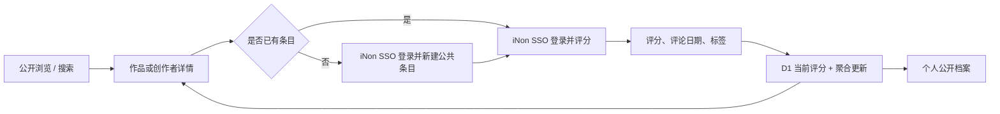
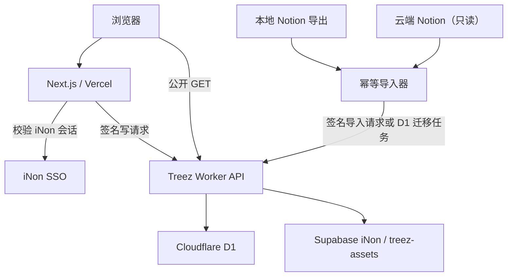

# Treez 首轮架构与领域模型

日期：2026-07-26

## 产品闭环

四个领域共享同一套实体、关系、评分、筛选和展示能力，不复制四套业务逻辑。

## 运行边界

- Vercel 继续承载现有 Next.js App Router 应用和 `treez.inon.space`。
- Worker 是公开业务 API，绑定 D1，并以服务端密钥写入 Supabase Storage。
- 浏览器只能执行公开读；写操作必须先到 Next.js Route Handler。
- Next.js 使用现有 `@inon-ai/inon-sso` 服务端能力识别用户。
- Next.js 对内部写请求签名，Worker 校验时间戳、用户声明、请求体摘要和 HMAC。
- 签名有效期短，并拒绝重放或超时请求。密钥只存在于 Vercel 环境变量与
  Cloudflare Worker Secret。

## 领域模型

### Entity

统一表示作品与创作者：

- `domain`：music / film / book / game
- `kind`：album / song / artist / film / director / book / author / game / studio
- 公共字段：名称、简介、封面、发布日期、规范化名称、创建者、公开时间
- 领域扩展字段存入 `entity_metadata`，避免把所有属性堆成大量可空列

合法组合由应用层和数据库约束共同保证：

| domain | kinds |
| --- | --- |
| music | album, song, artist |
| film | film, director |
| book | book, author |
| game | game, studio |

### EntityRelation

- `created_by`：作品到创作者
- `track_of`：单曲到专辑
- `contributed_by`：预留给多创作者协作
- `related_to`：仅用于真实、有语义说明的关联

关系有稳定唯一键、可排序位置和来源记录。反向展示通过查询生成，不复制关系。

### Rating

- 每位用户对每个实体只有一条当前评分。
- `score_tenths` 为 0–100 整数。
- `rated_at` 每次提交由 Worker 写成服务端当前时间，客户端不能提供。
- `commented_at` 默认服务端当前时间，用户可以提供合法日期。
- 更新评分时写入 `rating_events` 审计记录，但公开聚合只读取当前 `ratings`。
- 标签通过共享 `tags` 和 `rating_tags` 关联。

### Profile

D1 只保存 Treez 展示所需的 iNon 用户投影，不复制密码、会话或敏感身份信息。
用户首次写入时 upsert 公开档案；主键使用 iNon 稳定用户 ID。

### Source 与 Import

- `import_batches`：一次 dry-run 或 apply 的生命周期与计数。
- `source_records`：本地 Notion、云端 Notion或用户新增的来源、源 ID、路径、
  checksum、校验状态。
- `import_conflicts`：冲突类型、候选记录、处理状态与说明。
- `assets`：Supabase object key、原始 URL、内容类型、替代文字和实体归属。

## API 表面

公开读：

- `GET /v1/health`
- `GET /v1/home`
- `GET /v1/entities`
- `GET /v1/entities/:id`
- `GET /v1/search`
- `GET /v1/profiles/:slug`
- `GET /v1/tags`

签名写：

- `POST /v1/entities`
- `PUT /v1/entities/:id`
- `PUT /v1/entities/:id/rating`
- `POST /v1/assets`
- `POST /v1/import/batches`

响应统一为 `{ data, meta? }`；失败统一为
`{ error: { code, message, details? } }`。列表使用游标或稳定的 limit/offset，
并始终带明确排序。

## 安全边界

- 所有 D1 写操作在事务或批处理中保持实体、关系、评分事件一致。
- Worker 不信任来自浏览器的用户 ID。
- Next.js 不向浏览器暴露 Worker 签名密钥。
- CORS 仅允许生产域、Vercel 预览域和显式本地开发域执行公开读。
- 导入接口还需独立 scope，并记录批次和操作者。
- Markdown/Notion 正文渲染前做 HTML 清理；外链封面不直接作为永久存储。
- 所有用户输入有长度、枚举、日期和关系类型校验。

## UI 复用边界

- `EntityCard`、`EntityHero`、`EntityGrid` 跨四领域复用。
- `ScoreInput` 同时提供十分制与五星半星制，共用一个规范化值。
- `RatingEditor` 负责评分、评论、日期与标签。
- `DomainDirectory` 通过配置驱动四个领域的类型和筛选。
- `EditorialSection`、`Timeline`、`ProfileSummary` 构成个人鉴赏首页与档案。
- 数据访问只有一套 typed client；Server Component 与客户端交互共享 schema。

## 部署和回滚

- D1 变更只通过编号迁移执行；应用发布必须兼容当前和上一个 schema。
- Worker 先 dry-run，再发布版本；保留可回滚的前一版本。
- Vercel 生产发布在 Worker 健康检查和迁移验证之后进行。
- Supabase 对象使用内容摘要 key，重复导入不会重复上传；公共 bucket 只开放读取，
  写入必须经过签名 Worker。
- 部署记录、资源 ID、迁移结果、生产 URL 与回滚验证写入当天 `.agents/docs/`。
